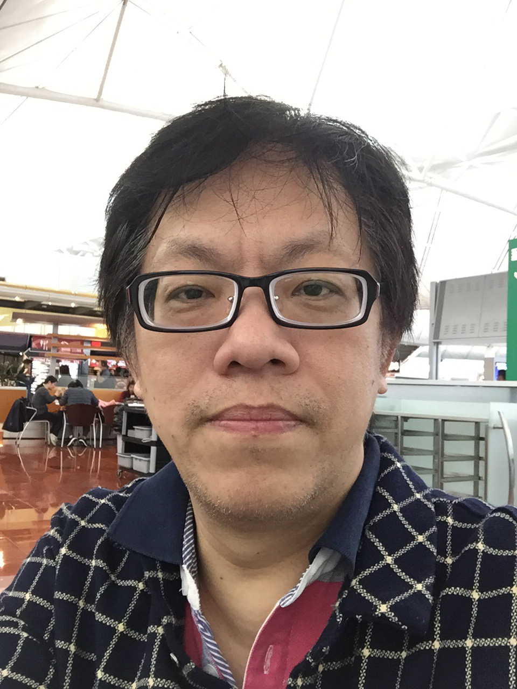

  

**個人資料簡介**   
中文姓名：林侊懋   
英文姓名：Karo Lin   
出生年份：西元1969年  
國籍：台灣🇹🇼  
最高學歷：國立成功大學 工業管理學士  
微信帳號：MasterKaro  
電子信箱：karolin4949@icloud.com  
LinkedIn:[Light Lin](https://www.linkedin.com/in/lightlin168/)  
  
**能力與專長**  

* 熟悉半導體封裝與測試，系統組裝流程。
* 善於應用統計製程分析，曾為多家半導體SPC主管。
* 善於應用 SPC，FMEA，MSA，APQP，PPAP 工具。
* 熟悉NPI新產品導入流程。
* 熟悉可靠性，失效分析以及8D檢討與執行。
* 愛好學習並與人員進行培訓以及分享。
* 長期為[JEDEC](https://www.jedec.org/ "JEDEC")以及[IPC](http://www.ipc.org/ "IPC")會員，並學習新技術。
* 喜好程序語言編寫，學習AI，區塊鏈，物聯網技術。
* 熱愛發現問題解決問題，公開演講，激勵士氣，共同成長。

**任職經歷**

1. 西元1996年 [青剛金屬建材](http://www.ckm.com.tw/) IE工程師  
負責現場設備安置規劃，工時統計分析，ISO9000導入。  

2. 西元1997年 [華東先進電子](https://www.walton.com.tw/) 生產主任  
監督以及培訓生產線員工執行產品測試蓋印包裝出貨流程，
確認產品的測試結果以及相關品質，生產排程確認，生產環境監督。

3. 西元2000年 [捷康半導體](http://www.vishay.com/company/brands/siliconix/) 製程品質工程師  
負責產品的生產品質監督，從晶圓來料檢查，晶圓測試，並使用SPC對封裝製程監控，同時對IC的異常分析結果，利用8D進行改善措施的確認以及效果的追蹤。

4. 西元2004年 [摩托羅拉](https://www.motorola.com/) 資深設計品質工程師  
擔任公司在ODM工廠的駐廠工程師，主要的工作是確認新手機的導入過程，以及工廠是否具備生產新手機的資格，對於人機料法環會經過系統性的一一檢查確認是否具足並且符合量產。  
曾經輔導過的公司有富士康，佳世達，華寶，王牌，正威，華宇，足跡遍佈中國以及印度。

5. 西元2010年 [矽品精密工業](http://www.spil.com.tw/) 製造品質經歷  
主要工作為確保產品生產的品質符合規格，從晶圓的來料檢驗直到測試後出貨，並且負責客戶的新產品導入，主要服務的客戶有聯發科，展訊，海思，Marvell以及其他中國內地的公司。  
針對產品的異常以及客訴處理也是親自帶領處理，藉此增加了很多製程改善的經驗，也能更加的服務客戶。

6. 西元2013年 [可成科技](http://www.catcher.com.tw/) 品質工程經理  
主要工作是負責品質工程的內容，制定品質計畫，監督生產的品質狀況，導入新產品，前期接觸的客戶有Dell，HP，Sony，熟悉客戶對於筆記型電腦外殼的導入過程以及產品特性的要求。  
後期主要是負責蘋果公司的手機殼導入，藉由此機會了機蘋果公司對於產品的品質要求，新產品導入的過程，量測設備以及方法的制定。

7. 西元2016年 [日月光半導體](http://www.aseglobal.com/) 製造品質經理
於此的工作主要是降低現場的PPM，尤其是打線製程所產生的問題想辦法下降，同時管理晶圓以及其他材料的品質，確保不會在生產過程中發生異常。  
擔任統計製程管控SPC主管，培訓相關人員統計製程的技術以及應用方法，定期檢視製程的穩定性，設法減少製程變異的因子。

8. 西元2016年 [安博電子](http://www.ablesz.com/) 品質處長  
於此期間的重點工作是導入歐美以及台灣對於半導體的生產以及品質的管控方式，推廣統計分析製程管控的方法，將JEDEC以及IPC標準以及要求傳遞給工廠管理幹部，利於公司與國際接軌，進一步提升技術能力。  
將ESD 20.20 落實於工廠並取得國際認證，後續計畫導入IATF16949汽車業界認證。

9. 西元2018年 [億光電子](http://www.everlight.com/) 品質經理  
管理供應商以及原物料的品質，監控生產過程中的品質管控，處理客戶抱怨，維持品質系統正常運作，擔任工廠的品質代表。

**培訓經歷**

* ISO9000 VBQi 內部稽核師
* TS16949 VBQi 內部稽核師
* SPC系統 Vishay管理師

**自傳**  
從小生長於一個普通的家庭，父母都是小學老師，在於人格的培養方面比較屬於嚴格管教，造成後天的自我警惕不能違背良心而行事。  
本人個性屬於喜好科學，新知，創新甚至於部分哲學方面，對於不理解的知識會存在很強的探索興趣，甚至不眠不休的研究學習。  
對於科技領域一直是最感興趣的部分，從Apple II的BASIC語言，IBM PC的組合語言，C語言一直到最近的Python語言都是不斷學習的項目，意識到未來人類除了要會與人類溝通的能力以外，還要懂得如何跟機器溝通，在不久的將來會是機器掌管人類的時代。
就業後從半導體產業開始，然後進入手機通訊，機械加工，基本上將產業的上下游都走了一遍，這件事其實對自我的能力有很大的助益，明白產品在什麼情況下會對下游造成什麼樣的影響，甚至發生了異常主要屬於哪一個製程為主要因素都可以容易的分析出來，這是一輩子在同一個生產線無法獲得的經驗。
   
---

  

**Personal Information**  
Name: Karo Lin  
Date of Birth: Feb1969  
Place of Birth: Taiwan🇹🇼  
Mobile :+86 13534026350  
E-mail: karolin4949@icloud.com  
WeChat: MasterKaro  
LinkedIn：[Light Lin](https://www.linkedin.com/in/lightlin168/)  

**Education Background**  
Bachelor of Industrial Management Science at NCKU.

**Skills & Self-assessment**  

* Well written and oral of English in communicating with others.  
* Computer Skill: be familiar with most of language (8086 Assembly, Basic,C, Pascal and Python) include DataBase System and Linux OS.
* Acquired SPC application certification, ISO 9000/TS 16949 internal auditor qualification.
* Good emotion quality and high desired to solve problem.   
* To learn the relational knowledge that to improve my job capability. I hope I will be the expert in my job.  
* This moment is the most important moment for me to follow my most exciting and to do the work to change the world with new technologies as IoT, BlackChain and AI.
* I will like to find a partner or a team with the same ideas and have passion to change the world.

**Work Experiences**  

**1. 1996 IE Engineer for [CKM](http://www.ckm.com.tw/)  Metal Construction Company.**
*Responsibilities include:*

* Introduced ISO9000 quality system.
* Facility Layout designed.
* Operation time research.

**2. 1997 Production supervisor on [Wasin](https://www.walton.com.tw/) Electronic Advance Company.**  
*Responsibilities include:*

* Set up products priority of testing line. 
* Managed and training operator for 12 hrs rotation shift. 
* Follow up correction action. 
* Alert and feedback for any production abnormal. 

**3. 2000 Quality engineer for [Vishay Siliconix](http://www.vishay.com/company/brands/siliconix/).**  
*Responsibilities include:*

* Been supervisor of IPQC team, leaded inspectors to check facility environment, Wafer testing, die separation, die bond, wire bond, packing, plating, lead forming/cutting and IC testing process.
* Did Wafer incoming quality control. 
* Been SPC coordinator for all processes. 
* Handled 8D system, from Issue 8D, check action then to follow up it.
* Handled FMEA system and update it when doing engineering change. 
* Handled Measurement management systems. 

**4. 2004 As a senior quality engineer for [Motorola](https://www.motorola.com/) Mobile Device Team.**
*Responsibilities includes :*

* Verified ODM/EMS facility environment, such as temperature, humidity, dust control, EOS/ESD system, products safety and security.
* Abnormal issues alert, feedback and held meeting for analysis and publish problem, review 8D.
* Check and review DFM  For before new product release for MP. 
* Check and review DFMEA and PFMEA to make all processes are safety. 
* Check and review all SOP are correct or not, includes warehouse control, SMT, Testing, Assembly, IQC, IPQC, FQC, OQC, and Packing. 
* Check and review QC plan, to make sure all control points and measurements are reasonable. 
* Monitor ECR, FCR, PCR and Mass situation. 
* Routing roving check key processes, review quality and production report. 
* To do customer buy-off before shipping and sign-off ship authority notice. 
* Setup and review reliability testing and review result. 

**5. 2010 Quality manger for SPIL semiconductor.**  
*Responsibilities include:*  

* Leaded quality team to reach company’s quality goal.
* Arranged Quality system training schedule for every body, include online and off-line lessons.
* Evaluated human resource for quality team.
* Handled abnormal issues of internal and customer feedback.
* Forecasted annual budget for quality team.

**6. 2013 Quality manager for [Catcher](http://www.catcher.com.tw/) Technology Company.**  
*Responsibilities include:*

* Leaded Quality Engineering department for well control production process. 
* Responsibility of new product introduce  for HP and Apple companies.
* Handled internal abnormal and customer’s complaint issues.
* Established measurement center for Apple iPhone housing.
* Forecasted measurement and reliability equipments for iPhone product.
* Routing meeting with customer to discussed NPI progress. 

**7. 2015 Quality manager for [ASE](http://www.aseglobal.com/) Company.**  
*Responsibilities include:*

* Monitored NPI process and been well control pilot run situation for new product, collected and analyzed data to improve NPI progress.
* Deal with the abnormal case, leaded team members to find out the root cause of defect and come out correct action, after that we also to verify the effective for those actions.
* Handled customer’s audit, leading customers to check our shop floor and follow up findings, reply correct actions and provide evidences to close those findings.

**8. 2016.8 Quality director for [Ablesz](http://www.ablesz.com/) semiconductor Company.**
*Responsibilities include:*

* Managed quality system.
* Trained all employees with quality concept and have quality mindset.
* Set up quality control methodology and follow JEDEC requirements.
* Introduce ESD 20.20 system, IS0 14000 and IATF16949.
*  Handled abnormal situations and find out solutions for recover it.

**9. 2018: Quality manager for [Everlight](http://www.everlight.com/) LED Ltd.**   
*Responsibilities include:*  

* Handling all quality system of the facility.
* Did Supplier management, for well control supplier’s quality by audit supplier processes, training supplier with quality tools and encourage their quality mindset.
* Leaded IQC, IPQC and OQC management, setup correct inspection method for incoming check, applied SPC system to stable process capability, introduced Lot by Lot produce system to avoid mix issue.
* Handled customer complain, doing failure analysis, find out root cause and defined correct actions to prevent defects happen again.
* Follow JEDEC definition to deal with product development and reliability test.  

**Biography:**  
My father and mother had been elementary school teachers. They were affecting me very much. Such as been like reading multi-type books, smart thinking and good behavior …etc.  

At the moment, when I was junior high school student, I was like to play computer. When I was at Province Ping Tong High School, I went to participate computer program design race. I got the 3rd rank award of the south at Taiwan.  

When studied at National Cheng Kong University, I used internet to contact many people all over the world; by the way I improved my English ability. 

Been a student of Industrial Management Science Department, I understood the Industrial and Business management knowledge. It is very useful in my work .
I have good emotion quality, and desire to solve problem. I was learn many knowledges by myself for work. I hope I will be the expert on the field.  

My first job was been an IE engineer for building material company, then I transferred to IC assembly factory (WALSIN Electron Company), I was a production supervisor in WALSIN, my work was to control products and operator.  

When I leaved WALSIN, I joined to another IC assembly/testing factory (Siliconix, Vishay, U.S.), this factory is locate at Kaohsiung, To be an  IPQC engineer, my job was to manage inspectors, review SPC, reply customer complain (8D), doing internal audit. I had get ISO/QS 9000 internal audit certification, and passed TS16949 certification, I have the TS16949 internal auditor qualification.  

After that, I joined Motorola personal communication section; to be a DQE engineer for ODM management. My job is to control ODM quality, it include incoming inspection, production quality audit, outgoing quality control and end user complain review. From Motorola system, I had learn many quality control method and reliability system, especial for mobile phone production system.  

For doing so many works, I’m lucky to learn many skill of different fields, such as Semiconductor, Electrical Assembly, Mechanical produce and serviced many great companies of the world. I think that I can doing better for work according to  those experiences from co-work with customers and learning by myself.