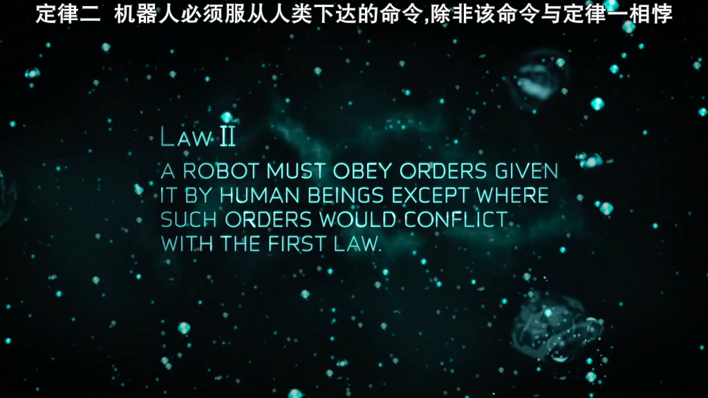
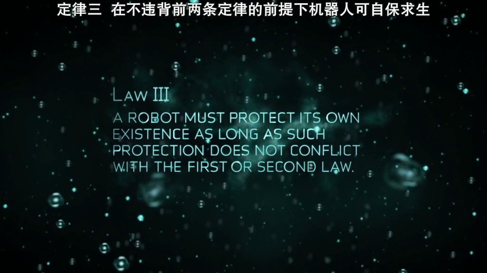

# karolin4949.github.io
This repository is my static page on GitHub.

**This is import.**

|Column1|Column2|Column3|
|-----|-----|-----|
|小雞|小狗|小鴨|

**Below is the pictures of Ronot Laws:**

Law I: A robot may not injure a human being or, through inaction, allow a human being to come to harm.

Law II: A Robot must obey orders given it by human being except where such orders would conflict with the first law.

Law III: A robot must protect its own existence as long as such protection dose not conflict with the first or the second law.

